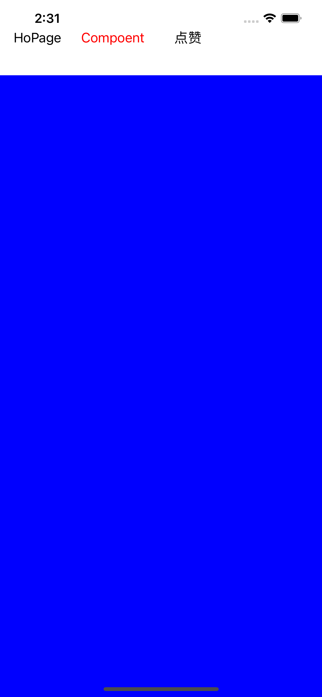
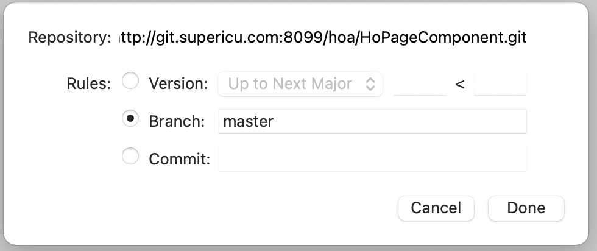

# HoPageCompoent
> 自定义左右滑动容器视图




## Installation

Swift 5.0 + :
Swift Packages

## Usage 
```swift
let colors = [UIColor.black, UIColor.blue, UIColor.red]
let titles = ["HoPage", "Compoent", "点赞"]

/// 初始化 下标位置
let dataCenter = HoPageDataCenter.init(1)

/// 菜单栏
let menus = DemoMenuBar(titles: titles, dataCenter: dataCenter)
let controllers = titles.enumerated().map { offset, _ -> UIViewController in
    
    let vc = DemoViewController(color: colors[offset])
    return vc
}
/// 容器视图
let contentView = HoPageContentView(controllers, parent: self, dataCenter: dataCenter)

/// 布局
view.addSubview(menus)
menus.frame = CGRect(x: 0, y: 0, width: UIScreen.main.bounds.width, height: 100)
menus.setupUI()

view.addSubview(contentView)
contentView.frame = CGRect(x: 0, y: 100, width: UIScreen.main.bounds.width, height: UIScreen.main.bounds.height - 100)

```

